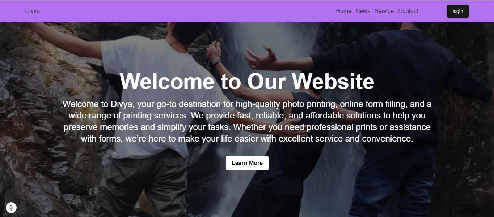
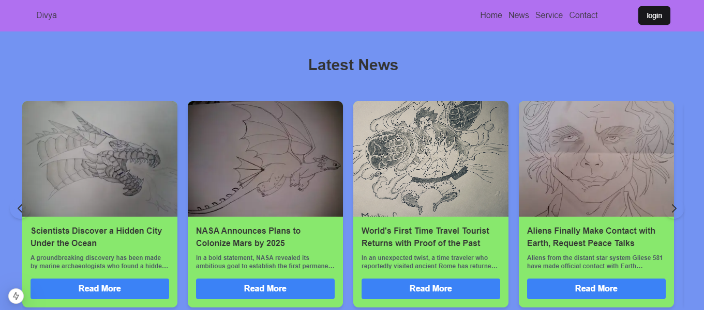
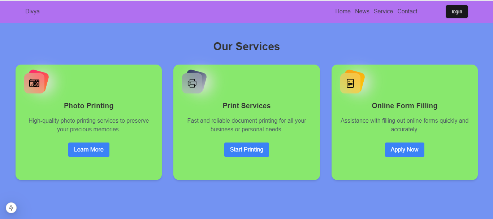
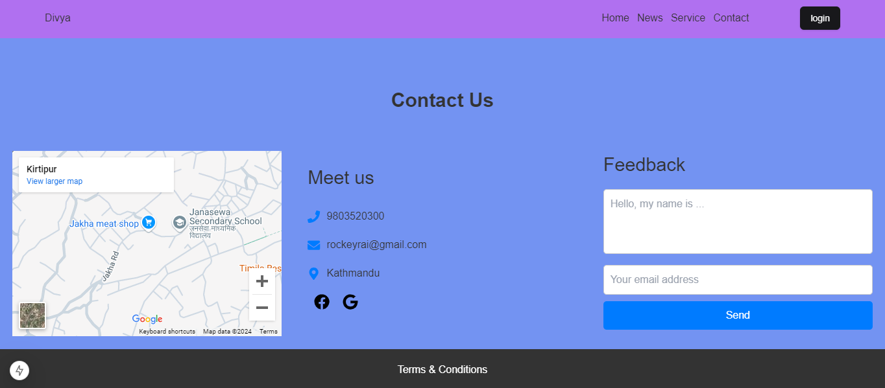
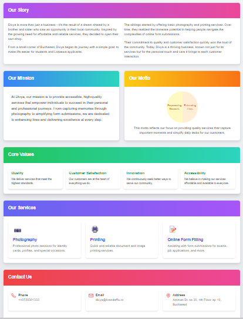
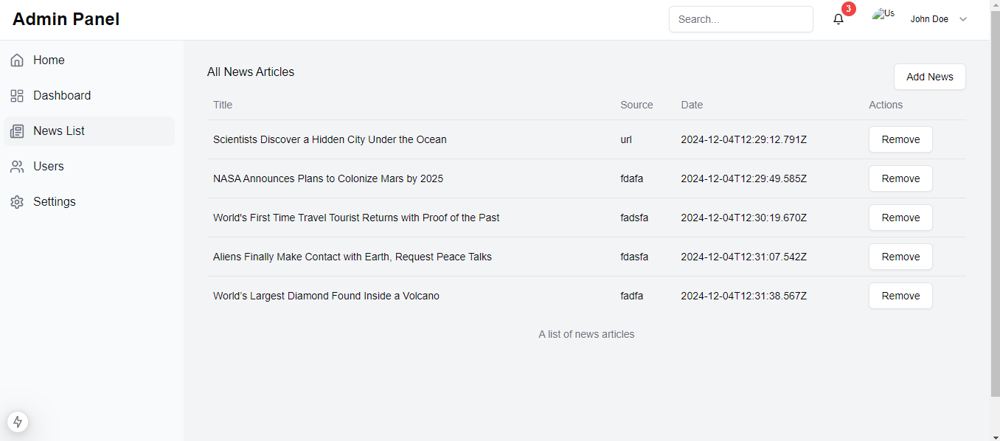

# Service Shop Project

A service shop web application that provides **News**, **Online Forms**, **Photos**, and **Print Services**. This project allows users to register, log in, and access various services while enabling the admin to manage content dynamically.

## Features

### User Features
- **Register**: New users can register (Duplicate registrations are prevented).
- **Login**: Access services and user dashboard after login.
- **News Section**: Stay updated with the latest news uploaded by the admin.
- **Feedback**: Users can send feedback via the contact section.
- **Smooth Scrolling**: Scroll through sections seamlessly using `ScrollToSection()`.
- **Location Map**: View the shop's location using an iframe map.

### Admin Features
- **Dynamic Content Management**:
  - Upload and manage news and images from the admin dashboard.
  - Change navbar, body, and card colors.
  - Replace the homepage image (deletes previous image automatically).
  - Delete news and the associated local image.
- **User Management**: Delete users from the admin dashboard.
- **Separate Dashboards**: Admin and user have distinct dashboards.
- **JWT Authentication**: Secure user verification and session management.

### Technical Highlights
- Images and news are saved in local directories:
  - News images: `server/upload/news/`
  - Homepage images: `server/upload/home/`
- Automatic cleanup: Deletes previous images from the database and local storage when replaced or removed.

---

## Tech Stack

### Backend
- **Node.js** with Express.js
- **Mongoose** for MongoDB
- Authentication: `bcrypt`, `jsonwebtoken`
- File Upload: `multer`
- Email Handling: `nodemailer`

### Frontend
- **Next.js**
- **React.js** for UI development
- State Management: `clsx`
- Animations: `framer-motion`
- Form Validation: `formik`, `yup`
- Notifications: `react-toastify`
- Smooth animations: `tailwindcss-animate`

---
### Demo 
<table>
  <tr>
    <td></td>
    <td></td>
    <td></td>
  </tr>
  <tr>
    <td></td>
    <td></td>
    <td></td>
  </tr>
</table>


---
## Installation

### 1. Clone the Repository
```bash
git clone https://github.com/rockeyrai/Divya.git
```

### 2. Install Frontend Dependencies
```bash
cd client
npm install next

```
### 3. Install Backend Dependencies
```bash
cd server
npm install express

```
### 4. Setup Public Folder
The public folder is included in .gitignore. You need to manually create it and image.

---
### 5. Usage
# Start the server
```bash
cd server
npm run dev
```
# Start the client
```bash
cd client
npm run dev
```

---
### Admin Panel
- Go to http://localhost:8000/admin to:
 - Upload news and homepage images.
 - Manage users and news.

### Environment Variables
Create a .env file in the server directory and add the following:
```bash
SECRET_KEY=your_jwt_secret_key
EMAIL_USER=your_email@example.com
EMAIL_PASS=your_email_password_or_app_specific_password
```
Create a .env file in the client directory and add the following:
```bash
NEXT_PUBLIC_API_URL=http://localhost:8000/
```
